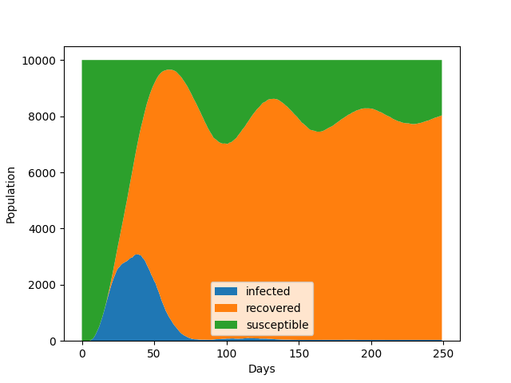

# Pandemic Cellular Automata Simulation

This project aims to enhance our understanding of disease dynamics during pandemics
by developing a novel simulation framework. Utilizing Probabilistic Cellular Automata
(PCA) and the SEIR model, the project introduces a detailed approach to modeling dis-
ease spread at the individual level, incorporating heterogeneous population attributes,
neighborhood interactions, and virus-antibody dynamics. Key features include proba-
bilistic randomness, hybrid control measures, and a saturation model for immune re-
sponse capacity. The simulation tool will be benchmarked against real-world data, such
as COVID-19 spread patterns, to validate its accuracy and applicability. The results will
provide actionable insights for researchers and policymakers, aiding in the design of more
effective pandemic control strategies. This work contributes to pandemic preparedness by
offering a flexible and detailed model for exploring various disease scenarios.

## Program Installation and Usage

Prerequisites include *Python v.3.12.7* and *Numpy v.2.1.1*.

1. Clone the repository
2. `cd` into the directory

```bash
cd pandemic-cellular-automata
```
3. Type the following command to display the help message (to see what options are available)

```bash
python cellsim.py -h
```
4. Run program with desired options
```bash
python cellsim.py [options]
```

## Focus and Features

* Probabilistic Automata
* Interaction within neighborhoods
* Effectiveness of control measures (e.g. quaratine strategies)
* Heterogeneous populations: variation of attributes for individuals (e.g. vulnerability, degree of contact)
* Integration of virus and antibody values per cell.


## Objectives

* Exploring the impact of diverse attributes on disease dynamics.
* Testing effectiveness of control measures.
* Real-world data fitting and prediction


## SEIR Model

$n_S, n_E, n_I, n_R$ denotes the population of susceptible, exposed, infected, and removed respectively. 

* $S\to E$: $p_e(n_E + n_I)$. 
* $E\to I$: $p_i$.
* $I\to R$: $p_r$. 

## Evaluation and Validation

* Benchmarks against real-world data (e.g., COVID-19 spread curves)
* Comparisons with existing PCA models

## Implementation

Each cell is treated as a target, and has two attributes: amount of virus `virus_val`, and amount of antibodies `antibody_val`.

The rate of change of the amount of virus depends on the amount of virus of neighboring cells (including the cell itself), and the amount of antibody of the cell itself. 

For the following discussion, let $V_i$ and $A_i$ denote the value of virus and antibody of cell $i$.

### Linear Model

The virus count in a cell depends on the virus concentration in neighboring cells:

$$
\frac{dV_i}{dt} = \alpha\sum_j k_{ij}V_j - \beta V_iA_i
$$

* $k_ij$ denotes the transmission rate from cell $j$ to cell $i$, and $\alpha$ denotes the replication rate of the virus
* $\mu$ denotes the rate of antibodies eliminating the virus

$$
\frac{dA_i}{dt} = \gamma V_i - \delta A_i
$$

* $\gamma$ denotes the rate of growth of antibodies stimulated by virus
* $\delta$ denotes the natural decay rate of antibodies

### Saturation Model

In saturation model, we introduce the saturation parameter $s$, which represents the capacity of the immune system to produce antibodies.

$$
\frac{dA_i}{dt} = \frac{\gamma V_i}{1 + sV_i} - \delta A_i
$$

### Heterogeneous Population and Fluctuation

To simulate variation in attributes of individual cells, when each cell is initialized, the parameters $\alpha, \beta, \gamma, \delta$ are sampled from log-normal distributions. 

To simulate randomness in virus and antibody production, for each step, the rate of changes $dV/dt$ and $dA/dt$ are scaled by random factors, which are sampled from a log-normal distribution with median $1$. 

## Results



*Sample image generated with default parameters and seed 0*


*Sample heatmap animation generated with default parameters and seed 0*

## Impact and Contributions

* Potential policy implications
* Open-source release for researchers and policymakers.
